# msa-capstone-project

# 평가항목
* 분석설계
* SAGA
* CQRS
* Correlation / Compensation
* Req / Resp
* Gateway
* Deploy / Pipeline
* Circuit Breaker
* Autoscale(HPA)
* Self-healing(Liveness Probe)
* Zero-downtime deploy(Readiness Probe)
* Config Map / Persustemce Volume
* Polyglot


# 분석 설계
# event storming 결과

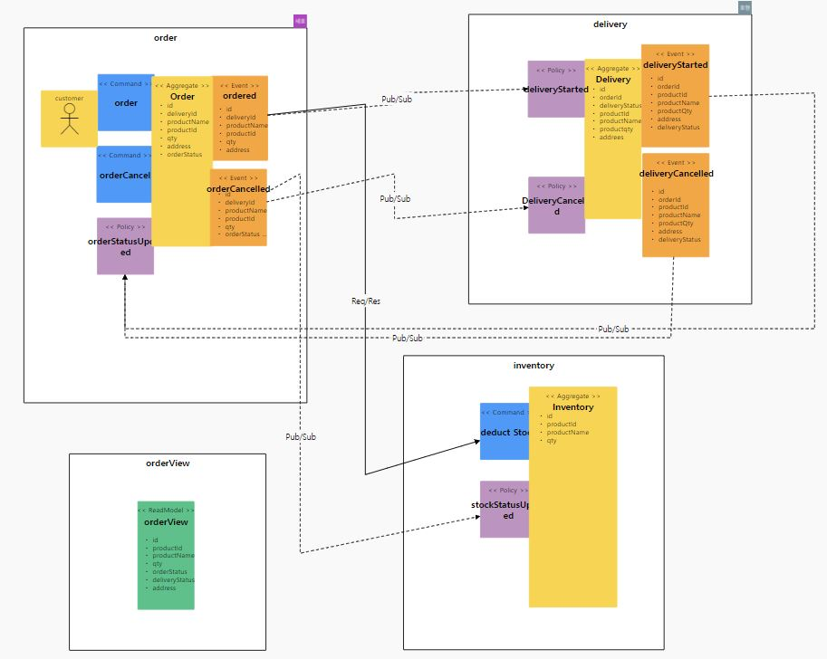


# 기능적 비기능적 요구사항 검토

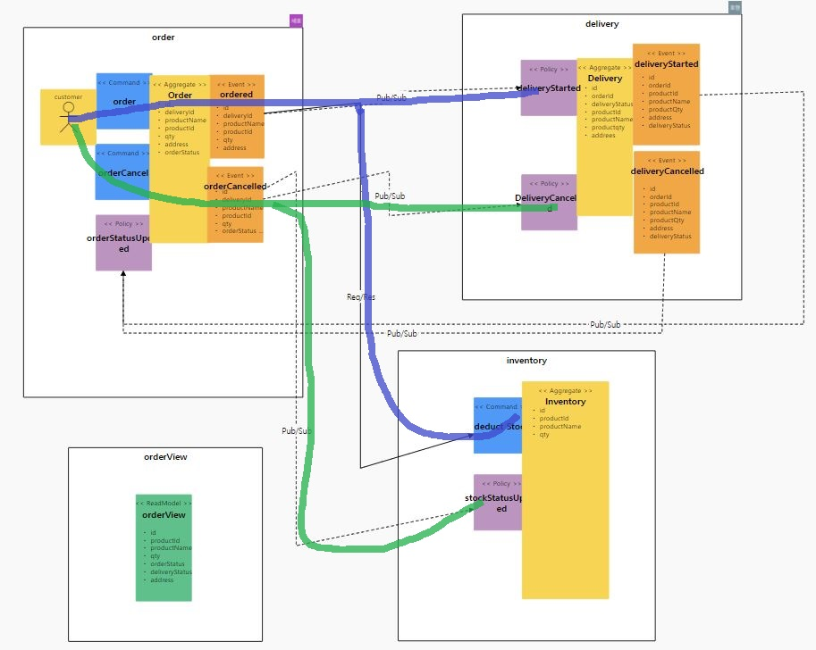

```
기능적 요구사항
1. 사용자가 주문을 한다
2. 주문이 시작되면 배송이 시작된다
3. 주문이 시작되면 재고가 감소한다
4. 주문이 취소되면 배송이 취소된다
5. 주문이 취소되면 재고가 증가한다


비기능적 요구사항
1. 마이크로 서비스를 넘나드는 시나리오에 대한 트랜잭션 처리
2. 주문시 재고가 있는지 확인한다
3. 고객이 주문상태를 주문시스템에서 확인할 수 있어야 한다 (CQRS)
```


# 헥사고날 아키텍처 다이어그램 도출

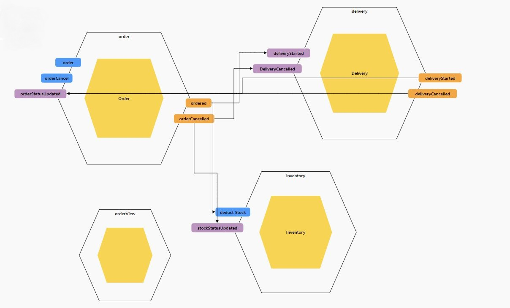


# SAGA
## - 구현
> 서비스를 아래와 같은 방법으로 개별적으로 실행한다. 

```
cd order
mvn spring-boot:run
```

```
cd orderView
mvn spring-boot:run
```

```
cd delivery
mvn spring-boot:run
```

```
cd inventory
mvn spring-boot:run
```

* DDD적용
> 4개의 도메인으로 관리되고 있으며 주문(Order), 배송(Delivery), 재고(Inventory), 주문조회(OrderView)으로 구성된다.

```
@Entity
@Table(name="Order_table")
public class Order  {

    @Id
    @GeneratedValue(strategy=GenerationType.AUTO)
    private Long id;
    private Long deliveryId;
    private String productName;
    private String productId;
    private Integer qty;
    private String address;
    private String orderStatus;

    @PostPersist
    public void onPostPersist(){
        Ordered ordered = new Ordered();
        BeanUtils.copyProperties(this, ordered);

        onlineshop.external.Inventory inventory = new onlineshop.external.Inventory();
        OrderApplication.applicationContext.getBean(onlineshop.external.InventoryService.class).deductStock(inventory);

        ordered.publishAfterCommit();
    }
    
```

* 서비스 호출흐름(Sync)
> 주문(Order) -> 재고조회(Inventory)간 호출은 동기식으로 일관성을 유지하는 트랜젝션으로 처리

* 고객이 상품,수량을 입력하고 주문 한다.
* 재고차감을 하기위해 FeinClient를 이용하여 인터페이스(Proxy)를 구현한다.
* 재고수량을 확인하여 수문수량 만큼 재고차감이 된 이후 (@PostPersist) 주문이 되도록 처리한다.

```
// InventoryService.java
package onlineshop.external;

import ...

@FeignClient(name="inventory", url="http://inventory:8083")
public interface InventoryService {
    @RequestMapping(method= RequestMethod.GET, path="/inventories")
    public void deductStock(@RequestBody Inventory inventory);

}
```
* 실시간 재고 차감을 위해 상품id 와 주문수량을 입력 받아 재고 차감 수행
* 수량이 부족하면 '재고 부족' 예외처리
* 수량이 충분하면 db 수량 차감 후 결과 리턴
```
@RestController
public class InventoryController {

    @Autowired
    InventoryService inventoryService;

    @PostMapping("/deduct")
    Inventory deduckQty(@RequestBody String data) throws Exception {
        System.out.println(data);

        ObjectMapper mapper = new ObjectMapper();
        Inventory product = null;
        try {
            product = mapper.readValue(data, Inventory.class);
        } catch (IOException e) {
            e.printStackTrace();
        }

        Inventory inventory = inventoryService.getProductByProductId(product.getProductId());

        if(inventory.getQty() < product.getQty()){
            throw new Exception("재고 부족");
        }else{
            inventoryService.decreaseStock(product.getProductId(),product.getQty());
        }

        return inventory;
    }
}
```
* 서비스 호출흐름(Async)
> 주문(Order) -> 배송(delivery)간 처리는 비동기식으로 처리함

* 배송상태를 업데이트 하고 그 내역을 Kafka로 전달

```
package onlineshop.domain;

import ..

@Entity
@Table(name="Delivery_table")
public class Delivery  {

    @Id
    @GeneratedValue(strategy=GenerationType.AUTO)
    private Long id;
    private Long orderId;
..

    @PostPersist
    public void onPostPersist(){
        DeliveryStarted deliveryStarted = new DeliveryStarted();
        BeanUtils.copyProperties(this, deliveryStarted);
        deliveryStarted.publishAfterCommit();
    }
```


# CQRS
* 주문 서비스(8081)와 배송 서비스(8082), 재고 서비스(8083)을 각각 실행
```
cd order
mvn spring-boot:run
```

```
cd delivery
mvn spring-boot:run
```

```
cd inventory
mvn spring-boot:run
```

* 상품 주문 
```
gitpod /workspace/msa-capstone-project (main) $ http POST :8081/orders productId=1 qty=1
```

``` 
HTTP/1.1 201 
Content-Type: application/json;charset=UTF-8
Date: Tue, 17 May 2022 05:14:37 GMT
Location: http://localhost:8081/orders/235
Transfer-Encoding: chunked

{
    "_links": {
        "order": {
            "href": "http://localhost:8081/orders/235"
        },
        "self": {
            "href": "http://localhost:8081/orders/235"
        }
    },
    "address": null,
    "deliveryId": null,
    "orderStatus": null,
    "productId": "1",
    "productName": null,
    "qty": 1
}


```

* 카프카 consumer 이벤트 모니터링
```
/usr/local/kafka/bin/kafka-console-consumer.sh --bootstrap-server localhost:9092 --topic shopmall --from-beginning
```
```
{"eventType":"OrderPlaced","timestamp":"20220517204951","id":1,"productId":1,"qty":1,"productName":null,"me":true}
{"eventType":"DeliveryStarted","timestamp":"20220517205636","id":1,"orderId":1,"productId":1,"productName":null,"me":true}
```

* orderView 서비스를 실행

```
cd orderView
mvn spring-boot:run
```
* orderView의 Query Model을 통해 주문상태와 배송상태를 통합조회
Query Model 은 발생한 모든 이벤트를 수신하여 자신만의 View로 데이터를 통합 조회 가능하게 함
```
http localhost:8084/orderStatuses/235
```

```
gitpod /workspace/msa-capstone-project (main) $ http :8084/orderStatuses/235
HTTP/1.1 200 
Content-Type: application/hal+json;charset=UTF-8
Date: Tue, 17 May 2022 06:07:01 GMT
Transfer-Encoding: chunked

{
    "_links": {
        "orderView": {
            "href": "http://localhost:8084/orderStatuses/235"
        },
        "self": {
            "href": "http://localhost:8084/orderStatuses/235"
        }
    },
    "address": null,
    "deliveryStatus": "delivery_started",
    "orderStatus": "ordered",
    "productId": 1,
    "productName": null,
    "qty": 1
}
```
> 주문 및 배송 정보가 orderView에 전달되어 상태 변경 된 것을 통합 조회 가능함


# Correlation / Compensation

* 주문 서비스에서 주문을 삭제하면 주문삭제 이벤트를 발행하고 배송 서비스에서 이벤트 수신하여 배송이 삭제가 되도록 함

1. 주문 생성
```
http POST :8081/orders productId=1 qty=1
```
```
HTTP/1.1 201
Content-Type: application/json;charset=UTF-8
Date: Tue, 17 May 2022 12:16:20 GMT
Location: http://localhost:8081/orders/3
Transfer-Encoding: chunked

{
    "_links": {
        "order": {
            "href": "http://localhost:8081/orders/3"
        },
        "self": {
            "href": "http://localhost:8081/orders/3"
        }
    },
    "productId": 1,
    "productName": null,
    "qty": 1
}
```

2. 배송이 시작됨
```
http :8082/deliveries/2
HTTP/1.1 200
Content-Type: application/hal+json;charset=UTF-8
Date: Tue, 17 May 2022 12:18:11 GMT
Transfer-Encoding: chunked

{
    "_links": {
        "delivery": {
            "href": "http://localhost:8082/deliveries/2"
        },
        "self": {
            "href": "http://localhost:8082/deliveries/2"
        }
    },
    "orderId": 3,
    "productId": 1,
    "productName": null
}
```
```
{"eventType":"OrderPlaced","timestamp":"20220517211620","id":3,"productId":1,"qty":1,"productName":null,"me":true}
{"eventType":"DeliveryStarted","timestamp":"20220517211620","id":2,"orderId":3,"productId":1,"productName":null,"me":true}
```
3. 주문 취소함
```
http DELETE :8081/orders/3

HTTP/1.1 204
Date: Tue, 17 May 2022 12:19:31 GMT
```

4. 배송 취소됨
```
http :8082/deliveries/2

HTTP/1.1 404
Content-Length: 0
Date: Tue, 17 May 2022 12:19:57 GMT
```

5. kafka console 로 메시지 확인
```
{"eventType":"OrderPlaced","timestamp":"20220517211620","id":3,"productId":1,"qty":1,"productName":null,"me":true}
{"eventType":"DeliveryStarted","timestamp":"20220517211620","id":2,"orderId":3,"productId":1,"productName":null,"me":true}
{"eventType":"OrderCancelled","timestamp":"20220517211931","id":3,"productId":1,"qty":1,"productName":null,"me":true}
{"eventType":"DeliveryCancelled","timestamp":"20220517211931","id":2,"orderId":3,"productId":1,"productName":null,"me":true}
```

6. 주문삭제 이벤트 발행 소스
```
public class OrderCancelled extends AbstractEvent {

    private Long id;
    private Long productId;
    private Integer qty;
    private String productName;

    public Long getId() {
        return id;
    }

    public void setId(Long id) {
        this.id = id;
    }
...
}
```
7. 배송서비스의 이벤트 수신 후 처리 소스
```
    @StreamListener(KafkaProcessor.INPUT)
    public void wheneverOrderCancelled_DeleteDelivery(@Payload OrderCancelled orderCancelled){
        if(orderCancelled.isMe()){
            List<Delivery> deliveryList = deliveryRepository.findByOrderId(orderCancelled.getId());
            if ((deliveryList != null) && !deliveryList.isEmpty()){
                deliveryRepository.deleteAll(deliveryList);
            }
        }
    }
```

# Req / Resp (feign client)

* Dependency 추가

```
		<dependency>
			<groupId>org.springframework.cloud</groupId>
			<artifactId>spring-cloud-starter-openfeign</artifactId>
		</dependency>
```

* 주문정보 db저장 전 재고차감 서비스 호출 

```
    @PrePersist
    public void checkInventory(){

        OrderPlaced orderPlaced = new OrderPlaced();
        BeanUtils.copyProperties(this, orderPlaced);

        Inventory inventory = new Inventory();
        inventory.setProductId(orderPlaced.getProductId());
        inventory.setQty(orderPlaced.getQty());

        // 재고차감
        InventoryService inventoryService = OrderApplication.applicationContext.getBean(InventoryService.class);
        inventoryService.deductStock(inventory);
    }
```

* 재고차감 서비스는 Interface 선언으로 Http Client 생성
```
@FeignClient(name ="inventory", url="${api.url.inventory}")
public interface InventoryService {

    @RequestMapping(method = RequestMethod.POST, value = "/deduct", consumes = "application/json")
    public void deductStock(@RequestBody Inventory inventory);
}
```

* 재고 서비스의 Controller는 품목 id와 수량 확인하여 재고 존재 시 차감, 재고 부족 시 예외발생
```
@RestController
public class InventoryController {

    @Autowired
    InventoryService inventoryService;

    @PostMapping("/deduct")
    Inventory deduckQty(@RequestBody String data) throws Exception {

        ObjectMapper mapper = new ObjectMapper();
        Inventory product = null;
        try {
            product = mapper.readValue(data, Inventory.class);
        } catch (IOException e) {
            e.printStackTrace();
        }

        Inventory inventory = inventoryService.getProductByProductId(product.getProductId());

        if(inventory.getQty() < product.getQty()){
            throw new Exception("재고 부족");
        }else{
            inventoryService.decreaseStock(product.getProductId(),product.getQty());
        }

        return inventory;
    }
}
```

* 재고 서비스의 초기 재고 정보 세팅, 품목 5개 각각 재고 100개 씩
```
public class InventoryApplication {
    public static ApplicationContext applicationContext;
    public static void main(String[] args) {
        applicationContext = SpringApplication.run(InventoryApplication.class, args);

        InventoryRepository productRepository = applicationContext.getBean(InventoryRepository.class);
        // 초기 상품 셋팅
        String[] products = {"TV", "MASK", "NOTEBOOK", "TABLE", "CLOCK"};
        long i = 1;
        for(String p : products){
            Inventory inventory = new Inventory();
            inventory.setProductId(i);
            inventory.setProductName(p);
            inventory.setQty(100);

            i++;
            productRepository.save(inventory);
        }


    }
}
```

* 재고 1개 차감 수행
```
http POST :8083/deduct productId=1 qty=1
```
```
HTTP/1.1 200
Content-Type: application/json;charset=UTF-8
Date: Tue, 17 May 2022 13:10:02 GMT
Transfer-Encoding: chunked

{
    "id": 1,
    "productId": 1,
    "productName": "TV",
    "qty": 99
}
```

* 재고 100개 차감 수행
```
http POST :8083/deduct productId=1 qty=100
```
```
HTTP/1.1 500
Connection: close
Content-Type: application/json;charset=UTF-8
Date: Tue, 17 May 2022 13:10:08 GMT
Transfer-Encoding: chunked

{
    "error": "Internal Server Error",
    "message": "재고 부족",
    "path": "/deduct",
    "status": 500,
    "timestamp": "2022-05-17T13:10:08.744+0000"
}
```

* 주문서비스와 재고 서비스 연계 테스트, 품목id:1, 수량 1개 주문 생성
```
http POST :8081/orders productId=1 qty=1
HTTP/1.1 201
Content-Type: application/json;charset=UTF-8
Date: Tue, 17 May 2022 13:39:56 GMT
Location: http://localhost:8081/orders/1
Transfer-Encoding: chunked

{
    "_links": {
        "order": {
            "href": "http://localhost:8081/orders/1"
        },
        "self": {
            "href": "http://localhost:8081/orders/1"
        }
    },
    "productId": 1,
    "productName": null,
    "qty": 1
}
```

* 품목 1번의 재고 99개 확인
```
http :8083/inventories/1
HTTP/1.1 200
Content-Type: application/hal+json;charset=UTF-8
Date: Tue, 17 May 2022 13:40:25 GMT
Transfer-Encoding: chunked

{
    "_links": {
        "inventory": {
            "href": "http://localhost:8083/inventories/1"
        },
        "self": {
            "href": "http://localhost:8083/inventories/1"
        }
    },
    "productId": 1,
    "productName": "TV",
    "qty": 98
}
```

# Gateway
1. 주문서비스와 배송서비스, pod 생성
```
apiVersion: apps/v1
kind: Deployment
metadata:
  name: order
  labels:
    app: order
spec:
  replicas: 1
  selector:
    matchLabels:
      app: order
  template:
    metadata:
      labels:
        app: order
    spec:
      containers:
        - name: order
          image: nukking/order:v1
          ports:
            - containerPort: 8080
---
apiVersion: apps/v1
kind: Deployment
metadata:
  name: delivery
  labels:
    app: delivery
spec:
  replicas: 1
  selector:
    matchLabels:
      app: delivery
  template:
    metadata:
      labels:
        app: delivery
    spec:
      containers:
        - name: delivery
          image: nukking/delivery:v1
          ports:
            - containerPort: 8080
```
2. 주문서비스와 배송서비스 서비스 생성
```
apiVersion: "v1"
kind: "Service"
metadata: 
  name: "order"
  labels: 
    app: "order"
spec: 
  ports: 
    - 
      port: 8080
      targetPort: 8080
  selector: 
    app: "order"
  type: "ClusterIP"
---
apiVersion: "v1"
kind: "Service"
metadata: 
  name: "delivery"
  labels: 
    app: "delivery"
spec: 
  ports: 
    - 
      port: 8080
      targetPort: 8080
  selector: 
    app: "delivery"
  type: "ClusterIP"

```

3. VirtualService 생성
```
1.virtualservice.yaml
---
apiVersion: networking.istio.io/v1alpha3
kind: VirtualService
metadata:
  name: onlineshop-order
spec:
  hosts:
  - "*"
  gateways:
  - onlineshop
  http:
  - match:
    - uri:
        prefix: /order
    route:
    - destination:
        host: order
        port:
          number: 8080
---
apiVersion: networking.istio.io/v1alpha3
kind: VirtualService
metadata:
  name: onlineshop-delivery
spec:
  hosts:
  - "*"
  gateways:
  - onlineshop
  http:
  - match:
    - uri:
        prefix: /deliveries
    - uri:
        prefix: /delivery
    route:
    - destination:
        host: delivery
        port:
          number: 8080
---
kubectl apply -f 1.virtualservice.yaml
```
4. gateway 생성
```
gateway.yaml
---
apiVersion: networking.istio.io/v1alpha3
kind: Gateway
metadata:
  name: onlineshop
spec:
  selector:
    istio: ingressgateway # use istio default controller
  servers:
  - port:
      number: 80
      name: http
      protocol: HTTP
    hosts:
    - "*"
---
kubectl apply -f gateway.yaml
```
5. gateway 주소 확인
```
kubectl -n istio-system get service/istio-ingressgateway
Kubeconfig user entry is using deprecated API version client.authentication.k8s.io/v1alpha1. Run 'aws eks update-kubeconfig' to update.
NAME                   TYPE           CLUSTER-IP       EXTERNAL-IP                                                                   PORT(S)                                                                      AGE
istio-ingressgateway   LoadBalancer   10.100.186.240   af729885f01234cbab4cff55e7947498-920146518.ap-northeast-1.elb.amazonaws.com   15021:32393/TCP,80:30840/TCP,443:30562/TCP,31400:30848/TCP,15443:31158/TCP   3h40m

```

6. 서비스가 정상적으로 서비스 되고 있음을 확인
```
http af729885f01234cbab4cff55e7947498-920146518.ap-northeast-1.elb.amazonaws.com/orders
HTTP/1.1 200 OK
content-type: application/hal+json;charset=UTF-8
date: Tue, 17 May 2022 18:17:59 GMT
server: istio-envoy
transfer-encoding: chunked
x-envoy-upstream-service-time: 12

{
    "_embedded": {
        "orders": []
    },
    "_links": {
        "profile": {
            "href": "http://af729885f01234cbab4cff55e7947498-920146518.ap-northeast-1.elb.amazonaws.com/profile/orders"
        },
        "self": {
            "href": "http://af729885f01234cbab4cff55e7947498-920146518.ap-northeast-1.elb.amazonaws.com/orders{?page,size,sort}",
            "templated": true
        }
    },
    "page": {
        "number": 0,
        "size": 20,
        "totalElements": 0,
        "totalPages": 0
    }
}
```


# Deploy / Pipeline
* codebuild 배포

- CodeBuild 배포를 위한 codebuild.yaml 작성 
```
version: 0.2

env:
  variables:
   _PROJECT_NAME: "onlineshop"

phases:
  build:
    commands:
      - echo Build Starting on `date`
      - echo install kubectl
      - curl -LO "https://dl.k8s.io/release/$(curl -L -s https://dl.k8s.io/release/stable.txt)/bin/linux/amd64/kubectl"
      
  post_build:
    commands:
      - echo make docker image
      - cd /home/msa-capstone-project/onlineshop
      - cd docker build -t onlineshop/onlineshop:v1
      - echo connect kubectl
      - kubuctl_build.sh
      
 cache:
  paths:
   - '/root/.m2/**/*'
```

- kubuctl_build.sh 작성 
```
kubectl apply -f 0.deployment.yaml
kubectl apply -f 5.deployment.yaml
```

- AWS에서 CodeBuild 프로젝트를 생성 

```
빌드 프로젝트 구성
```

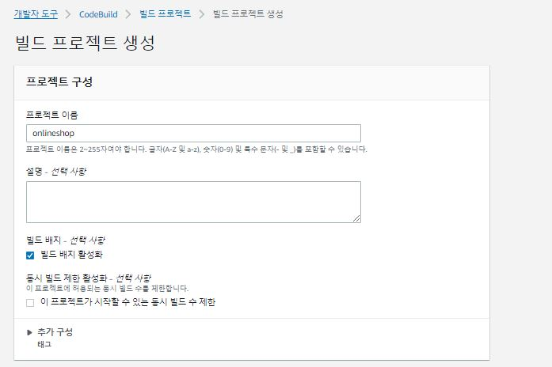


```
빌드 소스 경로 추가를 위한 레퍼지토리 연동 설정
```

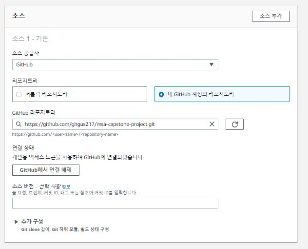

```
빌드 환경 설정
```

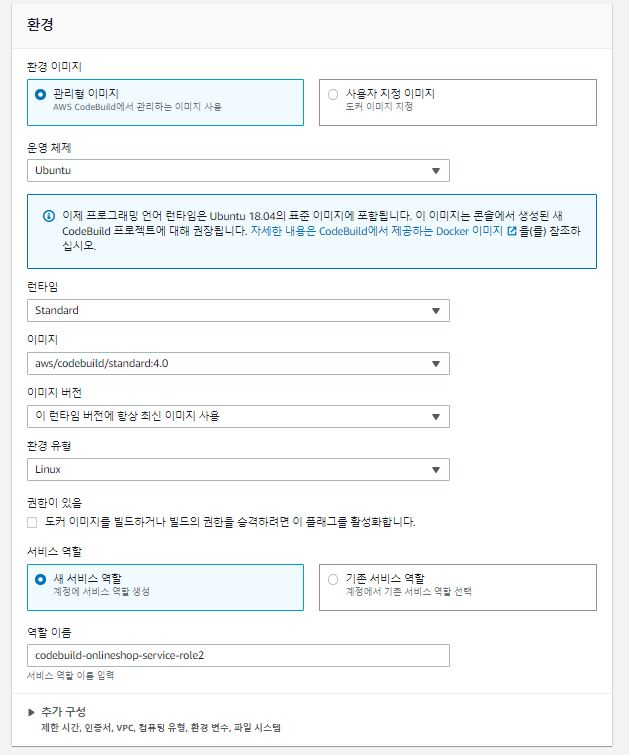


```
codebuild.yaml 경로 설정 
```

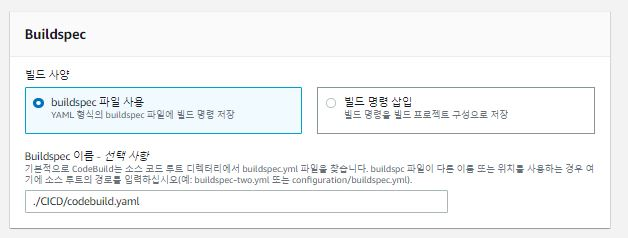


```
빌드 로그 확인을 위한 cloudwatch 로그 선택 
```

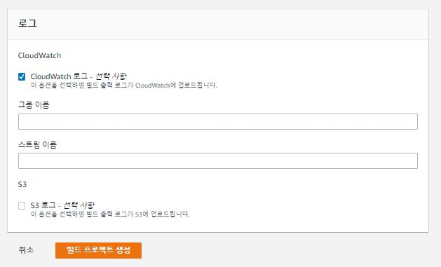


- codeBuild 시작


- Build Status


- Build Log


* CodePipeLine 자동 빌드 설정 


- CodePipeLine 자동 빌드 설정

```
기존의 codebuid 프로젝트의 배포 이력을 이용하여, github commit 이벤트 발생시 자동 빌드 수행하도록 pipeline 자동 빌드 설정
```

- 파이프라인 설정 선택

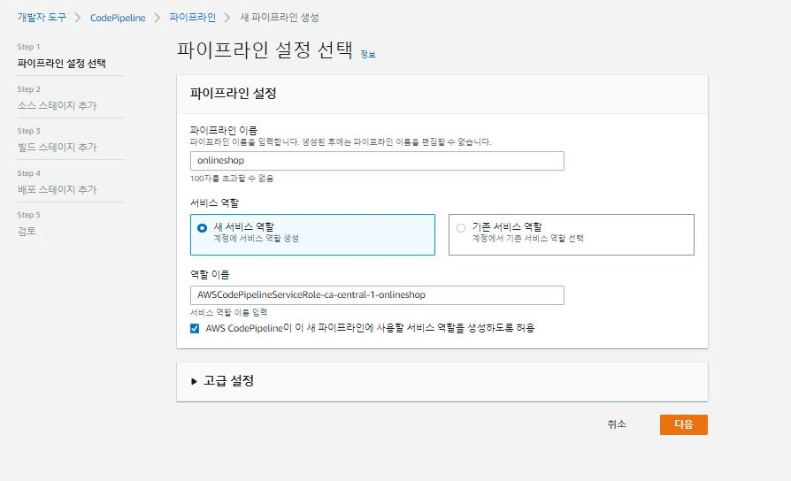


- 소스 스테이지 추가

```
github commit 이벤트 발생시 빌드 유발을 위한 소스 레퍼지토리 선택
```
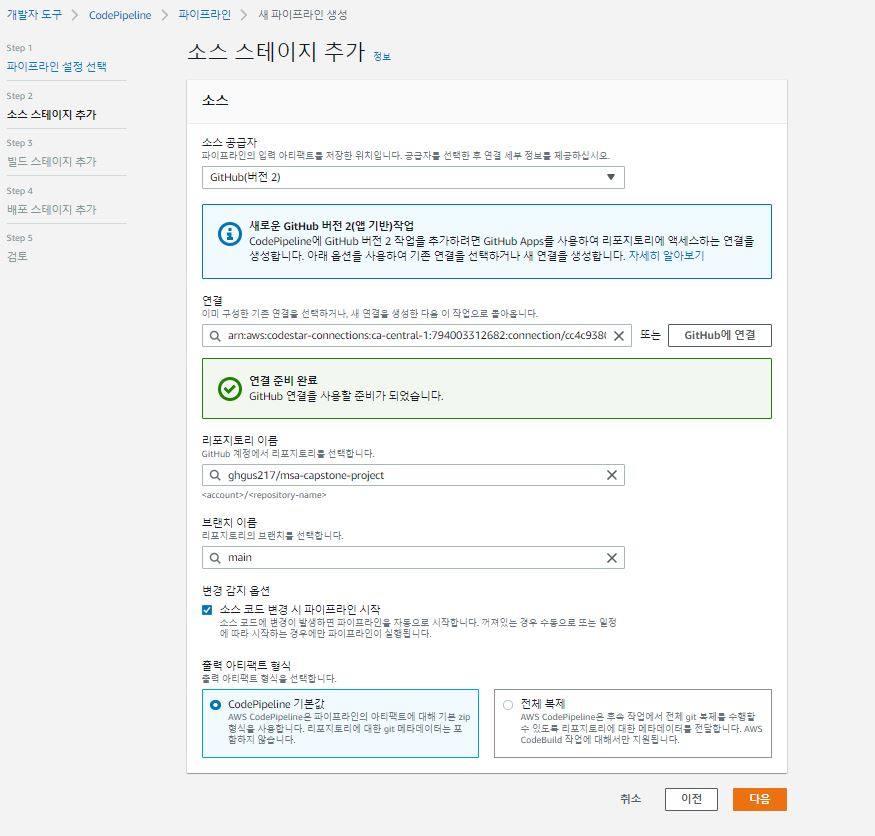


- 빌드 스테이지 추가

```
기존의 codebuild.yaml 빌드 선택
```

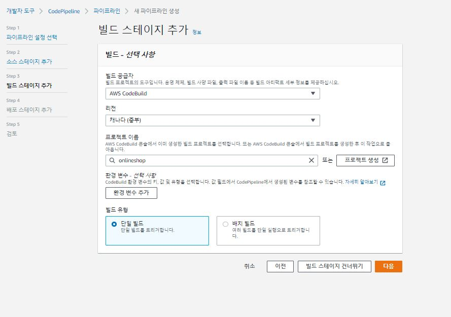


- 파이프 라인 배포 성공

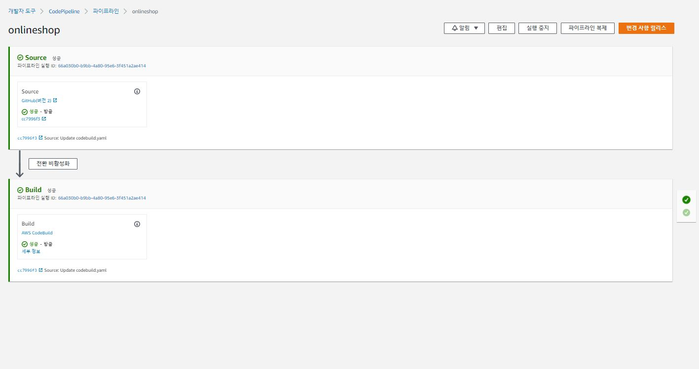


# Circuit Breaker
1. 배송 서비스로 서킷브레이커 구현, 배송 서비스 배포
```
kubectl create deploy delivery --image=nukking/delivery:v1 -n circuitbreaker
kubectl expose deploy delivery --port=8080 -n circuitbreaker
```
2. Circuit Breaker 설치
```
kubectl apply -f destinationrule.yaml
---
apiVersion: networking.istio.io/v1alpha3
kind: DestinationRule
metadata:
  name: dr-delivery
  namespace: circuitbreaker
spec:
  host: delivery
  trafficPolicy:
    outlierDetection:
      consecutive5xxErrors: 1
      interval: 1s
      baseEjectionTime: 3m
      maxEjectionPercent: 100
```

3. 배송서비스의 Replica를 3개로 스케일아웃
```
kubectl scale deploy delivery --replicas=3 -n circuitbreaker
```
4. 테스트 Pod 설치 및 동작 확인
```
kubectl create deploy siege --image=apexacme/siege-nginx -n circuitbreaker
kubectl get po -n circuitbreaker
kubectl exec -it pod/siege-88f7fdd8d-9shj7 -n circuitbreaker -c siege-nginx  -- /bin/bash
```

5. 배송서비스 확인 (Replica가 3개 이므로, 아래 명령을 3번 이상 호출하여 호스트 정보 확인)
```
root@siege-88f7fdd8d-9shj7:/# http http://delivery:8080/actuator/echo
HTTP/1.1 200 
Content-Length: 40
Content-Type: text/plain;charset=UTF-8
Date: Wed, 18 May 2022 04:16:44 GMT

delivery-67ff6476bb-skvh9/192.168.20.248
```
```
root@siege-88f7fdd8d-9shj7:/# http http://delivery:8080/actuator/echo
HTTP/1.1 200 
Content-Length: 40
Content-Type: text/plain;charset=UTF-8
Date: Wed, 18 May 2022 04:16:45 GMT

delivery-67ff6476bb-qgpg4/192.168.45.123
```
```
root@siege-88f7fdd8d-9shj7:/# http http://delivery:8080/actuator/echo
HTTP/1.1 200 
Content-Length: 40
Content-Type: text/plain;charset=UTF-8
Date: Wed, 18 May 2022 04:16:47 GMT

delivery-67ff6476bb-7chwp/192.168.76.205
```
6.  '/actuator/down’을 1회 호출하여 3개의 컨테이너 중 해당 호출을 받은 컨테이너는 ‘서비스 다운’ 
```
http PUT http://delivery:8080/actuator/down
HTTP/1.1 200 
Content-Type: application/json;charset=UTF-8
Date: Wed, 18 May 2022 04:18:23 GMT
Transfer-Encoding: chunked

{
    "status": "DOWN"
}
```
7. '/actuator/health’를 호출하면, ‘서비스 다운’ 상태인 컨테이너는 5xx 오류를 응답하게 된다. (3회 호출)
```
http://delivery:8080/actuator/health
HTTP/1.1 503 
Connection: close
Content-Type: application/vnd.spring-boot.actuator.v2+json;charset=UTF-8
Date: Wed, 18 May 2022 04:19:00 GMT
Transfer-Encoding: chunked

{
    "status": "DOWN"
}
```
8. 서킷브레이커가 발동하여 가용 서비스를 확인해 보면, 아래 명령에 대해 컨테이너 2개만 응답하는 것이 확인
```
root@siege-88f7fdd8d-9shj7:/# http http://delivery:8080/actuator/echo
HTTP/1.1 200 
Content-Length: 40
Content-Type: text/plain;charset=UTF-8
Date: Wed, 18 May 2022 04:19:40 GMT

delivery-67ff6476bb-skvh9/192.168.20.248
```
```
root@siege-88f7fdd8d-9shj7:/# http http://delivery:8080/actuator/echo
HTTP/1.1 200 
Content-Length: 40
Content-Type: text/plain;charset=UTF-8
Date: Wed, 18 May 2022 04:19:41 GMT

delivery-67ff6476bb-7chwp/192.168.76.205
```

# Autoscale(HPA)
1. 부하 테스트 Pod 설치
```
kubectl apply -f - <<EOF
apiVersion: v1
kind: Pod
metadata:
  name: siege
spec:
  containers:
  - name: siege
    image: apexacme/siege-nginx
EOF
```
2. 생성된 siege Pod 안쪽에서 정상작동 확인
```
kubectl exec -it siege -- /bin/bash
siege -c1 -t2S -v http://order:8080/orders
```
3. autoscale 설정
```
kubectl autoscale deployment order --cpu-percent=20 --min=1 --max=3
```
4. kubectl get hpa 명령어로 설정값을 확인 
```
gitpod /workspace/msa-capstone-project/kube_work (main) $ kubectl get hpa
Kubeconfig user entry is using deprecated API version client.authentication.k8s.io/v1alpha1. Run 'aws eks update-kubeconfig' to update.
NAME    REFERENCE          TARGETS   MINPODS   MAXPODS   REPLICAS   AGE
order   Deployment/order   3%/20%    1         3         1          12m
```

5. 배포파일에 CPU 요청에 대한 값을 지정
```
3.deployment.yaml

          ports:
            - containerPort: 8080
          resources:
            requests:
              cpu: "200m"
          readinessProbe:    # 이부분!
            httpGet:
              path: '/orders'
              port: 8080
            initialDelaySeconds: 10
            timeoutSeconds: 2
            periodSeconds: 5
            failureThreshold: 10
	    
```

6. seige 명령으로 부하를 주어서 Pod 가 늘어나도록 한다
```
siege -c20 -t40S -v http://order:8080/orders
```
7. pod 가 생성되는 것을 확인
```
gitpod /workspace/msa-capstone-project/kube_work (main) $ kubectl get po -w 
Kubeconfig user entry is using deprecated API version client.authentication.k8s.io/v1alpha1. Run 'aws eks update-kubeconfig' to update.
NAME                     READY   STATUS    RESTARTS   AGE
httpbin                  2/2     Running   0          112m
order-78bc6dcf57-929b2   2/2     Running   0          73s
siege                    2/2     Running   0          58m
order-78bc6dcf57-7pr86   0/2     Pending   0          0s
order-78bc6dcf57-7pr86   0/2     Pending   0          0s
order-78bc6dcf57-7pr86   0/2     Init:0/1   0          0s
order-78bc6dcf57-q4gjb   0/2     Pending    0          0s
order-78bc6dcf57-q4gjb   0/2     Pending    0          0s
order-78bc6dcf57-q4gjb   0/2     Init:0/1   0          0s
order-78bc6dcf57-q4gjb   0/2     PodInitializing   0          2s
order-78bc6dcf57-7pr86   0/2     PodInitializing   0          2s
order-78bc6dcf57-7pr86   0/2     Running           0          3s
order-78bc6dcf57-7pr86   1/2     Running           0          6s
order-78bc6dcf57-q4gjb   0/2     Running           0          10s
order-78bc6dcf57-q4gjb   1/2     Running           0          12s
order-78bc6dcf57-7pr86   2/2     Running           0          21s
order-78bc6dcf57-q4gjb   2/2     Running           0          27s

```
8. kubectl get hpa 명령어로 CPU 값 확인
```
^Cgitpod /workspace/msa-capstone-project/kube_work (main) $ kubectl get hpa
Kubeconfig user entry is using deprecated API version client.authentication.k8s.io/v1alpha1. Run 'aws eks update-kubeconfig' to update.
NAME    REFERENCE          TARGETS    MINPODS   MAXPODS   REPLICAS   AGE
order   Deployment/order   137%/20%   1         3         3          13m
```


# Self-healing(Liveness Probe)
1. 오더 서비스에 메모리 릭 유발하도록 소스 수정
```
@RestController
public class OrderController {

 @GetMapping("/callMemleak")
 public void callMemleak() {
  try {
   this.memLeak();
  }catch (Exception e){
   e.printStackTrace();
  }
 }

 public void memLeak() throws NoSuchFieldException, ClassNotFoundException, IllegalAccessException {
  Class unsafeClass = Class.forName("sun.misc.Unsafe");
  Field f = unsafeClass.getDeclaredField("theUnsafe");
  f.setAccessible(true);
  Unsafe unsafe = (Unsafe) f.get(null);
  System.out.print("4..3..2..1...");
  try
  {
   for(;;)
    unsafe.allocateMemory(1024*1024);
  } catch(Error e) {
   System.out.println("Boom :)");
   e.printStackTrace();
  }
 }

}
```
2. 현재 오더 서비스 정상동작 확인
```
root@siege:/# http http://order:8080/orders
HTTP/1.1 200 OK
content-type: application/hal+json;charset=UTF-8
date: Tue, 17 May 2022 16:35:12 GMT
server: envoy
transfer-encoding: chunked
x-envoy-upstream-service-time: 850

{
    "_embedded": {
        "orders": []
    },
    "_links": {
        "profile": {
            "href": "http://order:8080/profile/orders"
        },
        "self": {
            "href": "http://order:8080/orders{?page,size,sort}",
            "templated": true
        }
    },
    "page": {
        "number": 0,
        "size": 20,
        "totalElements": 0,
        "totalPages": 0
    }
}
```
3. 수정 소스 패키징 후 오더 서비스에 새로운 배포본 적용
```
2.deployment.yaml

apiVersion: apps/v1
kind: Deployment
metadata:
  name: order
  labels:
    app: order
spec:
  replicas: 1
  selector:
    matchLabels:
      app: order
  template:
    metadata:
      labels:
        app: order
    spec:
      containers:
        - name: order
          image: nukking/order:v3
          ports:
            - containerPort: 8080
```

4. 메모리 릭 유발하는 서비스 호출
```
http http://order:8080/callMemleak
```

5. po 상태 확인, 메모리 릭으로 kill 되나 반복해서 생성됨을 확인
```
gitpod /workspace/msa-capstone-project/kube_work (main) $ kubectl get po -w
Kubeconfig user entry is using deprecated API version client.authentication.k8s.io/v1alpha1. Run 'aws eks update-kubeconfig' to update.
NAME                    READY   STATUS    RESTARTS   AGE
httpbin                 2/2     Running   0          91m
order-57b7db878-srjcb   2/2     Running   0          30s
siege                   2/2     Running   0          38m
order-57b7db878-srjcb   0/2     OOMKilled   0          41s
order-57b7db878-srjcb   1/2     Running     2          42s
order-57b7db878-srjcb   2/2     Running     2          43s

```


# Zero-downtime deploy(Readiness Probe)
1. readinessProbe 가 없는 상태에서 배포 진행
```
0.deployment.yaml

apiVersion: apps/v1
kind: Deployment
metadata:
  name: order
  labels:
    app: order
spec:
  replicas: 1
  selector:
    matchLabels:
      app: order
  template:
    metadata:
      labels:
        app: order
    spec:
      containers:
        - name: order
          image: nukking/order:v1
          ports:
            - containerPort: 8080
---
apiVersion: "v1"
kind: "Service"
metadata: 
  name: "order"
  labels: 
    app: "order"
spec: 
  ports: 
    - 
      port: 8080
      targetPort: 8080
  selector: 
    app: "order"
  type: "ClusterIP"
```
2. siege Pod 안쪽에서 정상작동 확인
```
kubectl exec -it siege -- /bin/bash
siege -c1 -t2S -v http://order:8080/orders
** SIEGE 4.0.4
** Preparing 1 concurrent users for battle.
The server is now under siege...
HTTP/1.1 200     0.01 secs:     344 bytes ==> GET  /orders
HTTP/1.1 200     0.01 secs:     344 bytes ==> GET  /orders
HTTP/1.1 200     0.02 secs:     344 bytes ==> GET  /orders
HTTP/1.1 200     0.02 secs:     344 bytes ==> GET  /orders
HTTP/1.1 200     0.01 secs:     344 bytes ==> GET  /orders
...
Lifting the server siege...
Transactions:                     75 hits
Availability:                 100.00 %

```

3. readinessProbe 를 설정하고 배포 준비
```
1.deployment.yaml

apiVersion: apps/v1
kind: Deployment
metadata:
  name: order
  labels:
    app: order
spec:
  replicas: 1
  selector:
    matchLabels:
      app: order
  template:
    metadata:
      labels:
        app: order
    spec:
      containers:
        - name: order
          image: nukking/order:v2
          ports:
            - containerPort: 8080
          readinessProbe:    # 이부분!
            httpGet:
              path: '/orders'
              port: 8080
            initialDelaySeconds: 10
            timeoutSeconds: 2
            periodSeconds: 5
            failureThreshold: 10
```

3. readinessProbe 를 설정하고 배포본 적용하면서 부하테스트 실행
```
root@siege:/# siege -c1 -t60S -v http://order:8080/orders --delay=1S
** SIEGE 4.0.4
** Preparing 1 concurrent users for battle.
The server is now under siege...
HTTP/1.1 200     1.06 secs:     344 bytes ==> GET  /orders
HTTP/1.1 200     0.02 secs:     344 bytes ==> GET  /orders
HTTP/1.1 200     0.02 secs:     344 bytes ==> GET  /orders
HTTP/1.1 200     0.02 secs:     344 bytes ==> GET  /orders
HTTP/1.1 200     0.01 secs:     344 bytes ==> GET  /orders
...


Lifting the server siege...
Transactions:                    115 hits
Availability:                 100.00 %
Elapsed time:                  59.39 secs
Data transferred:               0.04 MB
Response time:                  0.03 secs
Transaction rate:               1.94 trans/sec
Throughput:                     0.00 MB/sec
Concurrency:                    0.06
Successful transactions:         115
Failed transactions:               1
Longest transaction:            1.06
Shortest transaction:           0.01
```

4. po 및 배포 상태 확인

```
gitpod /workspace/msa-capstone-project/kube_work (main) $ kubectl get po
Kubeconfig user entry is using deprecated API version client.authentication.k8s.io/v1alpha1. Run 'aws eks update-kubeconfig' to update.
NAME                     READY   STATUS    RESTARTS   AGE
httpbin                  2/2     Running   0          72m
order-557d8c49b-smc49    1/2     Running   0          22s
order-7f8498d87b-9dqmn   2/2     Running   0          85s
siege                    2/2     Running   0          19m
gitpod /workspace/msa-capstone-project/kube_work (main) $ kubectl get po
Kubeconfig user entry is using deprecated API version client.authentication.k8s.io/v1alpha1. Run 'aws eks update-kubeconfig' to update.
NAME                     READY   STATUS        RESTARTS   AGE
httpbin                  2/2     Running       0          72m
order-557d8c49b-smc49    2/2     Running       0          27s
order-7f8498d87b-9dqmn   2/2     Terminating   0          90s
siege                    2/2     Running       0          19m
```


# Config Map / PersistenceVolume 
1. pvc 생성
```
pvc.yaml

apiVersion: v1
kind: PersistentVolumeClaim
metadata:
  name: fs
  labels:
    app: test-pvc
spec:
  accessModes:
  - ReadWriteOnce
  resources:
    requests:
      storage: 1Mi
```

2. secret create
```
apiVersion: v1
kind: Secret
metadata:
  name: mysql-pass
type: Opaque
data:
  password: YWRtaW4=     
```
3. mysql에 pvc, secret 적용
```
4.deployment.yaml
---
apiVersion: v1
kind: Pod
metadata:
  name: mysql
  labels:
    name: lbl-k8s-mysql
spec:
  containers:
  - name: mysql
    image: mysql:latest
    env:
    - name: MYSQL_ROOT_PASSWORD
      valueFrom:
        secretKeyRef:
          name: mysql-pass
          key: password
    ports:
    - name: mysql
      containerPort: 3306
      protocol: TCP
    volumeMounts:
    - name: k8s-mysql-storage
      mountPath: /var/lib/mysql
  volumes:
  - name: k8s-mysql-storage
    persistentVolumeClaim:
      claimName: "fs"

---

apiVersion: "apps/v1"
kind: "Deployment"
metadata: 
  name: "order"
  labels: 
    app: "order"
spec: 
  selector: 
    matchLabels: 
      app: "order"
  replicas: 1
  template: 
    metadata: 
      labels: 
        app: "order"
    spec: 
      containers: 
        - 
          name: "order"
          image: "nukking/order:db"
          ports: 
            - 
              containerPort: 80
          env:
            - name: superuser.userId
              value: userId
            - name: _DATASOURCE_ADDRESS
              value: mysql
            - name: _DATASOURCE_TABLESPACE
              value: orderdb
            - name: _DATASOURCE_USERNAME
              value: root
            - name: _DATASOURCE_PASSWORD
              valueFrom:
                secretKeyRef:
                  name: mysql-pass
                  key: password
```

4. mysql db 활성화
```
kubectl exec mysql -it -- bash
mysql --user=root --password=$MYSQL_ROOT_PASSWORD
mysql> create database orderdb;
mysql> show databases;
+--------------------+
| Database           |
+--------------------+
| information_schema |
| mysql              |
| orderdb            |
| performance_schema |
| sys                |
+--------------------+

```

5. 주문 생성
```
http order:8080/orders productId=1 customerId="sjh"

HTTP/1.1 201 Created
content-type: application/json;charset=UTF-8
date: Tue, 17 May 2022 17:35:06 GMT
location: http://order:8080/orders/1
server: envoy
transfer-encoding: chunked
x-envoy-upstream-service-time: 895

{
    "_links": {
        "delivery": {
            "href": "http://order:8080/orders/1/delivery"
        },
        "order": {
            "href": "http://order:8080/orders/1"
        },
        "product": {
            "href": "http://order:8080/orders/1/product"
        },
        "self": {
            "href": "http://order:8080/orders/1"
        }
    },
    "customerAddr": null,
    "customerId": "sjh",
    "customerName": null,
    "price": 10000,
    "productId": 1,
    "productName": "TV",
    "quantity": 0,
    "state": "OrderPlaced"
}

```

6.mysql 삭제 후 재실행
```
kubectl delete pod mysql
kubectl apply -f 4.deployment.yaml
```

7.mysql 삭제 후 재실행 하기 전 오더 존재 확인
```
http order:8080/orders/1
HTTP/1.1 200 OK
content-type: application/hal+json;charset=UTF-8
date: Tue, 17 May 2022 17:50:16 GMT
server: envoy
transfer-encoding: chunked
x-envoy-upstream-service-time: 161

{
    "_links": {
        "delivery": {
            "href": "http://order:8080/orders/1/delivery"
        },
        "order": {
            "href": "http://order:8080/orders/1"
        },
        "product": {
            "href": "http://order:8080/orders/1/product"
        },
        "self": {
            "href": "http://order:8080/orders/1"
        }
    },
    "customerAddr": null,
    "customerId": "sjh",
    "customerName": null,
    "price": 10000,
    "productId": 1,
    "productName": "TV",
    "quantity": 0,
    "state": "OrderPlaced"
}
```


# Polyglot
* 배송모듈 Java -> Kotlin 변환
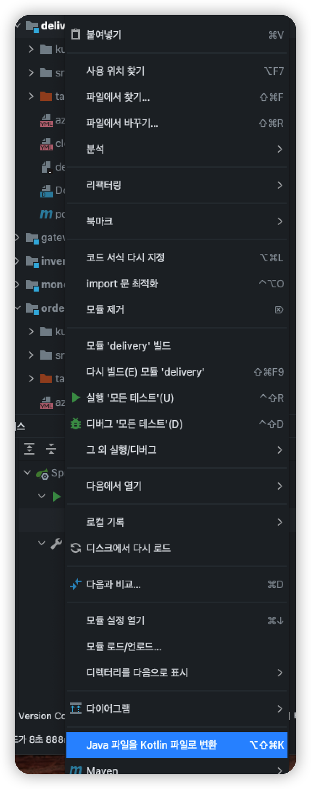

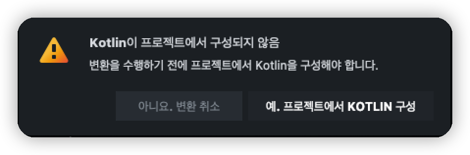

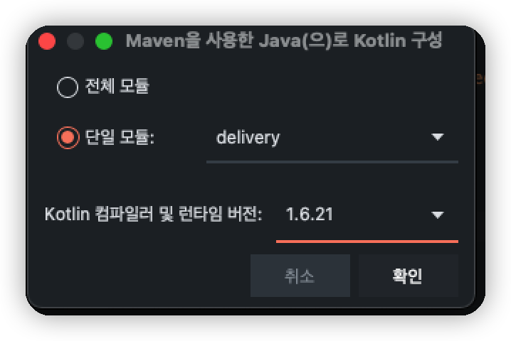

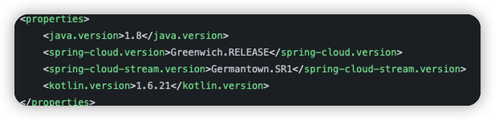


</img>
